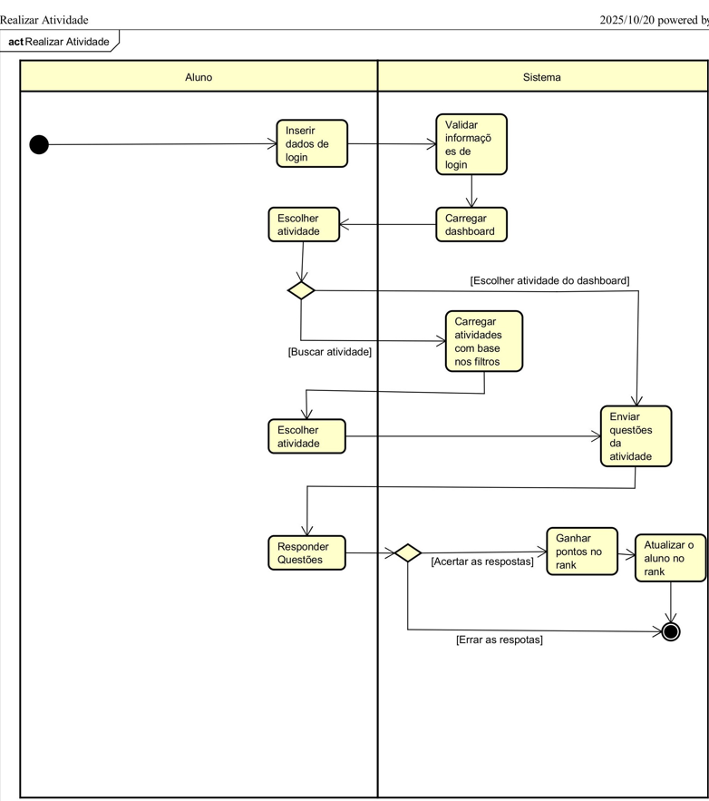
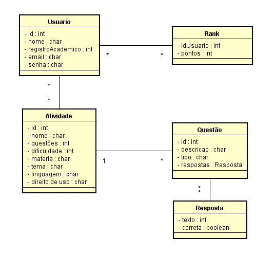

[Entrevista com Prof Duarte (Editado).txt](https://github.com/user-attachments/files/23470425/Entrevista.com.Prof.Duarte.Editado.txt)
# Projeto Disciplina: Requisitos de Software

Olá! Este repositório faz parte do projeto da disciplina de Requisitos de Software da UTFPR - Campus Cornélio Procópio. 

Link do Padlet: https://padlet.com/rossipoke/kanban-yzskebb8cfh8no7f

## 1. Introdução

***1.1.  Nome do Grupo***

Samuel Ribeiro da Costa - https://github.com/Sam-Ribeiro

Raphael Rossi - https://github.com/rossipoke

***1.2.  Nome do Sistema***

MindSteps

***1.3.  Propósito do Sistema***

Este documento apresenta os requisitos dos usuários a serem desenvolvidos pela **MindSteps Corporation**, fornecendo aos desenvolvedores as informações necessárias para o projeto e implementação, assim como para a realização dos testes e homologação do sistema.

O objetivo do sistema **MindSteps** é oferecer uma plataforma gamificada de apoio ao ensino universitário, permitindo que professores criem desafios de forma prática e que alunos estudem de maneira mais motivadora e recompensadora. A solução busca facilitar o acompanhamento do desempenho, estimular a disciplina nos estudos diários e transformar o aprendizado em uma experiência dinâmica.

***1.2.  Público Alvo***

O público-alvo do aplicativo são professores e estudantes universitários que buscam tornar o processo de ensino mais dinâmico e leve. Professores que precisam de ferramentas práticas para criar e acompanhar atividades, aumentando o engajamento da turma, enquanto alunos desejam métodos de estudo interativos e motivadores que facilitem a organização e a assimilação de conteúdos.

***Personas:***

____

***Análise da situação atual: antes da introdução de sua solução***

*`1. O que as pessoas fazem?`*

Professores preparam listas de exercícios, trabalhos e leituras, geralmente em papel ou PDF.

Alunos recebem as atividades, muitas vezes sem prazos intermediários ou incentivos de engajamento.

O estudo costuma ser individual e pouco interativo, com baixa motivação.

A entrega das atividades ocorre por e-mail ou sistemas acadêmicos engessados.

*`2. Quais os artefatos envolvidos?`*

Apostilas, livros físicos e PDFs.

Plataformas institucionais (como Moodle ou Google Classroom).

E-mail para comunicação.

Papel e caneta para resolução de exercícios.

*`3. O que elas precisam saber?`*

Como acessar as plataformas da universidade.

Datas de provas e entregas de trabalhos.

Conteúdo das disciplinas (geralmente de forma tradicional).

Ferramentas digitais básicas (Word, Excel, PowerPoint).

____

***Análise das tarefas depois: como serão executadas as suas tarefas com sua solução:***

*`1. O que as pessoas fazem?`*

Professores criam desafios diários e atividades gamificadas diretamente no aplicativo.

Alunos acessam os desafios pelo celular ou computador e respondem de forma interativa.

O progresso é acompanhado em tempo real, com pontuações, recompensas e rankings.

Feedback é dado automaticamente ou de forma facilitada pelo professor.

*`2. Quais os artefatos envolvidos?`*

Aplicativo gamificado (plataforma web/mobile).

Sistema de pontuação, recompensas e rankings.

Relatórios automáticos de desempenho.

Conteúdo digital interativo (quizzes, simuladores, vídeos curtos, flashcards).

*`3. O que elas precisam saber?`*

Como usar o aplicativo (interface intuitiva, login, navegação básica).

Regras de pontuação e funcionamento dos desafios.

Conteúdo das disciplinas, mas agora de forma mais aplicada e prática.

Como acompanhar o próprio progresso dentro do sistema.

____

***Cenário: Antes***

Ricardo (professor) envia uma lista de exercícios em PDF por e-mail. Lucas (aluno) baixa o arquivo, resolve no papel e, muitas vezes, esquece de entregar ou deixa para última hora. A motivação é baixa e o estudo é visto apenas como obrigação. Não há acompanhamento em tempo real e o professor demora para corrigir.

***Cenário: Depois***

Ricardo cria desafios diários no aplicativo. Lucas acessa pelo celular no intervalo entre aulas, responde aos exercícios interativos e acumula pontos. Ele acompanha seu progresso no ranking da turma, recebe feedback imediato e se sente motivado a continuar. Ricardo, por sua vez, visualiza relatórios automáticos com os acertos e dificuldades da turma, podendo ajustar o conteúdo das próximas aulas.

## 2. Documentos gerais no repositório

***2.1. Requisitos Funcionais***

| Código  | Nome | Descrição | Prioridade | MoSCoW | Dependencia |
| ------- | ---- | --------- | ---------- | ------ | ----------- |
| RF01 | Busca básica  | O sistema deve permitir buscar por nome de professor, questao especifica, disciplina, ou termo genérico. Resultado com cards resumidos (professor, disciplina, conteudo abordado e previa da questao). | Média | M | RF10 |
| RF02 | Perfil do professor / local | Ao abrir um resultado, exibir: foto/nome, departamento/faculdade, disciplinas que ministra, contato (email/ramal), banco de questoes do professor. | Alta | M | RF10 |
| RF03 | Pontuacao e Score | A depender do tempo de resposta e da resposta escolhida o usuario ganhara pontos para a conta, onde ele pode comparar com os amigos e colegas | Baixa | S | RF10 |
| RF04 | Considerar conflitos | Se uma questao tiver 30 ou mais pedidos de atualização por resposta errada/etc... a questao fica temporariamente desativada da plataforma ate a correção do professor responsavel. | Média | M | RF05 |
| RF05 | Modo professor | Permitir modo de criacao de questoes, avaliacao e edição de questoes criadas pelo proprio professor, referente ao login | Alta | M | N |
| RF06 | Favoritos e histórico | Salvar questoes/professores favoritos e histórico de questões | Média | S | RF10 |
| RF07 | Modos de preferências | O aluno pode escolher por preferencias de conteudos ou disciplinas, podendo se tornar tambem preparatorio para provas ou atividades | Média | S | RF11 |
| RF08 | Autenticação e níveis de acesso | Login via conta institucional (SSO) para acessar funcionalidades restritas (ex.: Perguntas apenas de professores da sua instituição). | Alta | M | RNF11 |
| RF09 | Feedback/Relatar problema | Usuários podem reportar erros nas respostas diretamente ao professor que a fez ou problemas de acessibilidade entre outros para o suporte de desenvolvimento | Média | M | RF10, RF05 |
| RF10 | Banco de dados | Banco relacional (ex.: PostgreSQL) para dados relacionais (professores, disciplinas, conteudos, questoes). | Alta | M | N |
| RF11 | Categorização de perguntas | O sistema deve categorizar perguntas, com os tipos dela (como disciplina, dificuldade, professor criador, assunto...). | Alta | M | RF05 |
| RF12 | Score e competitividade | Os usuarios vao ter uma aba de score e pontuacoes tanto em nivel geral (universidades nacionais) quanto da propria universidade ou amigos | Media | M | RF03 | 
 
***2.2. Requisitos Não Funcionais***

| Código  | Nome | Descrição | Prioridade | MoSCoW | Dependencia |
| ------- | ---- | --------- | ---------- | ------ | ----------- |
| RNF01 | Tempo de resposta | Tempo de resposta para busca simples ≤ 5s | Baixa | M | RF10 |
| RNF02 | Escalabilidade | Suportar crescimento até 3000 usuários ativos simultâneos | Alta | M | N |
| RNF03 | Seguranca de senhas | Senhas não armazenadas localmente. Controle de acesso baseado em papéis; logs de auditoria | Média | S | RFN11 |
| RNF04 | Segurança | Conformidade com LGPD (Brasil) — consentimento para uso de dados pessoais, direito de acesso, exclusão à pedido. Criptografia de senhas. | Média | M | N |
| RNF05 | Usabilidade | UX mobile-first; telas com tempo de aprendizado ≤ 5 min para usuário novo; suporte a acessibilidade WCAG AA (contraste, leitor de tela, navegação por teclado) | Média | M | N |
| RNF06 | Localização / Internacionalização | Texto configurável para PT-BR (padrão); suporte para EN e ES opcional. | Baixa | C | N |
| RNF07 | Autenticação de senhas | Autenticação via SSO; Suporte com login OAuth com o google do e-mail universitário ou credenciais do portal do aluno. | Média | S | RNF11 |
| RNF08 | Atualização de dados em tempo real | Webhooks ou sockets para receber notificações de alteração de questoes do sistema. | Alta | M | N |
| RNF09 | Logs e auditoria | Registrar eventos importantes (login, busca, questoes respondidas, pontos recebidos por questao, alteração de dados) para monitoramento e debugging | Baixa | S | RF10
| RNF10 | Backend e API | REST/GraphQL API para app (endpoints para busca, perfil, favoritos). Autorização baseada em roles. | Alta | M | RF10 |
| RNF11 | Integração com base institucional | API ou ETL para sincronizar dados: cadastro de professores, alunos, turmas, grade horária. | Média | S | N |
| RNF12 | Backup em tempo real | Backup deve ser realizado em tempo real com as informacoes registradas no servidor, onde o mesmo deve gerar uma copia das informacoes atualizadas e enviar o mesmo para o backup | Alta | M | RF10, RNF02 |

***2.3. Perguntas***

Qual disciplina(s) o(a) senhor(a) leciona atualmente e para quais cursos?

Há quanto tempo o(a) senhor(a) atua como docente no ensino superior?

O(a) senhor(a) costuma utilizar recursos digitais ou plataformas on-line em suas aulas? Quais?

Qual sua opinião geral sobre o uso de tecnologias educacionais na universidade?

O(a) senhor(a) já utilizou alguma estratégia de gamificação (como pontuação, ranking, desafios) em suas aulas?

Quais benefícios o(a) senhor(a) acredita que a gamificação pode trazer para o aprendizado dos alunos universitários?

E quais riscos ou limitações o(a) senhor(a) enxerga nesse tipo de abordagem?

Como o(a) senhor(a) imagina que um aplicativo gamificado poderia complementar suas aulas ou avaliações, de forma direta e/ou indireta?

Quais tipos de atividades o(a) senhor(a) acredita que seriam interessantes nesse aplicativo (quiz, desafios semanais, mini provas, etc.)?

Como o(a) senhor(a) gostaria que fosse o sistema de pontuação ou feedback para os alunos?

O(a) senhor(a) acredita que os professores da UTFPR adotariam um aplicativo como esse facilmente?

Quais fatores poderiam incentivar o uso (ex: integração com Moodle, interface simples, reconhecimento institucional)?

Quais fatores poderiam dificultar a adoção (ex: falta de tempo, curva de aprendizado, resistência a novas tecnologias)?

O(a) senhor(a) acredita que os alunos teriam interesse genuíno em competir e colaborar entre si através desse aplicativo?

Que tipo de suporte ou treinamento o(a) senhor(a) acharia importante para usar a plataforma?

O que o(a) senhor(a) mais valorizaria em um aplicativo educacional como esse?

O(a) senhor(a) teria alguma sugestão ou conselho para quem está desenvolvendo esse projeto?

Deseja acrescentar algum comentário ou reflexão sobre o uso de gamificação no ensino superior?

***2.4. Entrevista***

*[<Arquivo com as respostas do indivíduo entrevistado e link do drive com upload da gravação.>](https://drive.google.com/file/d/1IdwZusIsaCvx0wNpnqL9H-ckKNoJRPvn/view?usp=sharing)*

[Uploading Entrevista com Prof Duarte (Transcrito por TurboScribe.ai. Atualize para Ilimitado para remover esta mensagem.)

Então, vamos lá. Só para o senhor entender mais ou menos o projeto da disciplina, vai ser... não sei se o senhor já chegou a jogar Perguntados. O senhor já chegou a jogar? Cara, pelo nome, não. 

Mas, assim, ele deve ter uma aplicação. Isso, é. Ele é um aplicativo de celular, basicamente, onde a comunidade formula perguntas e você vai respondendo vários quizzes. Ele é um joguinho bem competitivo, é basicamente um jogo de quem responde mais, sabe? Aí, ele separa meio que por disciplinas, história, artes, e ele vai separando ciências, matemática.

E, basicamente, a comunidade vai fazendo, você vai desafiando as pessoas, seus amigos e tudo mais, e vai meio que gerando essa ideia. Entendi. A ideia do projeto, para a disciplina, é fazer tipo um Perguntados.

Na verdade, eu nem lembrei do Perguntados na hora. A gente foi desenvolvendo. Depois que eu fui lembrar, eu falei, nossa, mas eu jogava muito Perguntados.

Isso aqui está muito parecido. Ah, sim, mas é bacana isso aí, né? Só que daí... Não, não, é legal essa comunidade propondo as perguntas, né? É como se fosse um show do milhão aí da vida, né? Alguma coisa nesse... Aí, a ideia era basicamente fazer... Então, acabou que virou basicamente fazer um Perguntados, porém com foco 100% acadêmico universitário. Onde, tipo assim, vai basicamente usar os mesmos logins universitários, apenas professores formulam perguntas, e os alunos vão ter ali toda a base de dados de perguntas para poder usar.

Aí o professor vai desenvolver de acordo com as disciplinas que ele ministra, ou que ele sabe. Ah, ele ministra, por exemplo, processo de produção de software. Aí ele vai poder criar as perguntas dele ali, e o aluno pode tanto pesquisar pela disciplina, quanto por olhar perguntas aleatórias ali, respondendo, e aí a hora que chegar a pergunta vai ter.

Tipo assim, disciplina, processo de produção de software. E aí vai ter lá... E o cara escolhe a disciplina, e vocês pensaram em níveis, por exemplo, eu tenho perguntados, né? Eu posso ter perguntas geradas de forma aleatória, tanto uma pergunta complexa, quanto uma pergunta síntese, por exemplo. Nível iniciante, né? Eu começo lá com questões relacionadas a processo de software.

O que é processo de software? Como que você pode aplicar um processo, etc, e tal. Isso aí é um nível, para mim, introdutório. Agora, por exemplo, se você pensar num nível intermediário, aí eu já peço para o cara falar, por exemplo, quais são as vantagens e desvantagens de você ter um modelo cascata, em detrimento a um modelo espiral.

Então aí você já está usando um nível diferente. Quer dizer, o cara pelo menos tem que ler um capítulo, tem que ler o segundo capítulo do present, quanto do summer vai. Então, essa é a informação que eu queria só saber.

Por quê? Quando você gera um banco de questões, isso eu sei porque eu crio um processo de sistematização. E quando você sistematiza algumas coisas, você tem que ter um protocolo de sistematização. Esse protocolo define o quanto que você quer abranger.

Por exemplo, no meu processo, nós queremos medir o quanto de conhecimento uma pessoa tem antes de ser aplicada em uma residência em Sofra. Então, por exemplo, eu quero treinar um grupo para gestão de projetos. Só que quando eu estou treinando um grupo, o que acontece? Eu chego lá, se é uma disciplina de gestão de processo num curso de Unix Open, eu sei que eles já viram disciplinas de requisitos, eu sei que eles já viram disciplinas de qualidade.

E já, de alguma forma ou outra, participaram de momentos em que a gestão de processos ou de software aconteceu de uma forma adóxica, ou seja, aquela forma sem pensar ou sem imaginar. Então, é uma pessoa que minimamente teve uma experiência. Agora, se eu chego para gerenciar processos de software, gestão de software, por exemplo, em alguns lugares em que eu tenho níveis diferentes, eu tenho que mensurar para saber o que eu vou instanciar na minha base de conhecimento.

Então tá, se você vai construir um perguntado, por exemplo, se você vai construir um perguntado para um aluno de primeiro semestre, se você vai fazer um perguntado para um aluno de segundo semestre, seria legal, por exemplo, um perguntado para um aluno de segundo semestre de disciplinas que ele passou e foi treinado no primeiro. Seria legal? Sim, sim. Então, a ideia é que meio que o aluno pode tanto definir o nível onde ele vai pegar, onde ele vai abrangir, quanto pelo login, por gerir com o login universitário, poder associar teoricamente a base de dados, por exemplo, da própria UTF, sabe? Então, tipo assim, se ele já passou por tais disciplinas, passar como recomendação para ele as disciplinas que ele já passou para que ele responda ou as que ele já está fazendo.

Assim, ele tem tanto ali um incentivo a estudar mais as disciplinas que ele está fazendo quanto poder relembrar as que ele já fez. Legal, legal. Então, meio que seria um perguntados ali, só que na ideia mais geral de abrangir o máximo possível do público universitário para pegar tanto o que as pessoas já passaram quanto, sei lá, a pessoa quer descobrir ou ver como vai ser tal matéria, ele pode acessar às vezes uma matéria que ele ainda não tem, mas que ele tem interesse e já ver algumas perguntas, já ver ali algumas questões, mesmo que ele não acerte, mas pelo menos começar ali a ter meio que uma base, entendeu? Legal.

E você está fazendo esse trabalho para Engenharia de Requisitos? Isso. Para Requisitos de Software, no caso. Oi? Para Requisitos de Software, no caso.

Ah, tá. E é a professora Erika? Quem é? Não vou confirmar, mas eu acho que é, sim. É, porque Engenharia de Requisitos é com ela.

A professora Camila. Não é a Camila. É a Camila Dias.

Ah, tá, então. Porque, o que na verdade é o seguinte, quando você trabalha Requisitos, quando você trabalha essa parte de avaliação, através de perguntas e respostas, isso aí é uma situação que a gente baseia na gestão de conhecimento. Certo.

Então, o legal, para você construir um perguntado, para você ter uma eficiência ao meu modo de... Eu procuro não me preparar para nenhum tipo de resposta que eu tenho, porque se não, depois eu não aceito o contraditório. Então, é bom que... Quando você estuda muito alguma coisa, você se torna chato. Ah, não, sim. 

Eu compreendo. Isso é uma característica de professor-doutor. Como eu não sou doutor, eu sou um cara mais aberto.

Porque o que você vai fazer? Você vai construir uma base de questões, mas você tem um foco muito forte na gestão do conhecimento. Porque o conhecimento, a gente brinca que ele é uma escada. Você vai subindo alguns degraus.

Você tem o conhecimento explícito, aquele que você lê, que você ouve, aquele que você estuda, e você tem o tal do conhecimento tácito, algumas coisas que você aprendeu fora dos livros ou fora de qualquer meio, através de experiência, ou até mesmo de uma expertise própria sua. Então, nas questões que envolvem essa questão, que eu falo assim, olha, eu quero criar alguma coisa para fazer com que a pessoa faça o uso do meu produto para que aquele produto me traga mais conhecimento. Porque, por exemplo, eu fiz um questionário nos perguntados.

Você consegue dimensionar que existem perguntas que a maioria irão acertar ou não, como minhas provas de algoritmos. Eu sei das questões que eu ponho e procuro corrigi-las todas de uma mesma forma. Questão 1, questão 2, questão 3. E depois a minha vontade, e eu acho que todo professor deveria fazer isso, dar o feedback, sentar para o aluno e ele aprender com aquilo que ele não conseguiu.

Então, o legal do seu produto é depois dar o review, que aí o seu produto vai ficar forte. Por exemplo, uma vez a gente estava brincando de me cozinhar, falando sobre fazer comida. Então, se você pegar, por exemplo, uma pessoa que nunca cozinhou e você falava assim... Pô, você já fez um macarrão à carbonara? Agora, se você falava... Olha, você já comeu um macarrão que vai ovos, queijo ralado e bacon? Ah, já.

Então, esse é o à carbonara. Não sei se você captou a ideia. Eu queria que o seu perguntado avaliasse as pessoas e depois explicasse para ela o porquê aquela resposta dela não estava correta.

Você já imaginou você colocar uma questão lá. Olha, o que é processo de software? Alternativa A, B e C. O cara vai lá e escolhe a B. O certo era o C. Aí, quando o cara pede para corrigir, o cara põe que é a B. Tá, tudo bem. Mas você já pensou uma... Vamos colocar assim... Usa seu sobrenome, né? A gente criou um bonequinho chamado Poquezinho.

Aí, o Poquezinho vai lá e fala para ele, olha, é a alternativa B, por isso, por isso, por isso. Cara, vai ficar show de bola o seu produto, cara. Poxa, é uma coisa que eu poderia colocar, incluindo como, querendo ou não, quem vai estruturar as perguntas são os professores, eu acho que seria exatamente muito interessante.

Tipo, eles colocarem pequenas explicações Isso. Isso. A ideia desse... desses bonequinhos, né? Do Rafaelzinho aí, do Rossizinho, o Poquezinho lá, que vai, que vai de uma forma ou outra trazer uma... uma explicação por que que ele errou.

Eu acho muito legal avaliar alguém ou ser avaliado. Mas, olha, eu assinelei A e eu assinelei B. Ah, você errou. Tá, eu errei.

Mas, por que daquela alternativa ser a correta? Assim, viu? O Rafa faz um bonequinho lá como se fosse um... olha, processo, vem disso, software vem daqui, então a união daqueles dois, através até de voz, se for o caso, né? Mesmo que o professor escreva uma explicação sobre aquela resposta, e depois põe um leitor de voz... Dá pra fazer, até hoje, com o mundo das IAS extremamente desenvolvido, querendo ou não, dá pra colocar elas pra gerarem, às vezes, uma voz. Fica mais fácil transcrever algo escrito pra voz. É, porque, assim, isso daqui deu certo uma vez numa empresa que nós fizemos uma consultoria, e essa empresa ela adotava a abelha como uma inspiração.

A abelha, se você desenvolver bem, ela não deveria voar. Ela não deveria voar. Ela voa de teimoso.

E ela produz um dos melhores alimentos do mundo. O urubu é o cara que melhor voa, só que só faz merda, né? Então eles criaram uma animação chamada abelhinha. Então o cara pode ler os produtos que a empresa vende, ou clicar no botão e a abelha explica.

Você pegou? Peguei, peguei. Cara, porque, assim, a gente, eu falo assim, a gente come com os olhos, né, cara? Se você pôr um prato bonito, um talher bonito, um aparador, cara, você pode servir uma comida razoável. Se você leva essa mesma comida razoável para um outro ambiente menos bonito, parece que muda o gosto, né? Parece, é aquela coisa que a gente come primeiro com os olhos, depois com o nariz, depois com a boca.

Então, isso é o legal do seu perguntado. Esse é o grande, eu acho assim, diferencial, né? Particularmente, eu não gosto de ficar lendo muito as coisas, sabe? Eu prefiro ouvir, eu prefiro falar, eu sempre brinco que eu tenho mais chance de ter sucesso falando do que escrevendo. Mas é verdade, porque no escrever você é frio, no conversar eu posso mandar uma mensagem, mas na verdade eu posso estar pensando, esse cara é um filho da puta, né? Agora, se eu falar para você, você está vendo os meus olhos, né? Embora nesse momento não, mas você sente ali uma coisa minha.

Querendo ou não, a voz acaba mal transmitindo muito sentimento. Com certeza, com certeza. Então, eu acho assim, hoje, para mim, software é uma coisa muito legal, cara. 

A gente não vive sem, a gente... Mas, assim, a gente tem que começar a trazer mais pessoas, né? E o produto que mais cativar, o produto que mais conseguir tocar as pessoas vai ser o produto mais durado, né? Então, você já pensou, o Rafael fez um perguntado, o Sandro fez um perguntado, mas o perguntado do Rafael, tem um bonequinho que brinca, que fala, valeu, cara, você foi bem, não sei o quê. Cara, por que você não continua, né? Por que você não passa por um... Todo produto, ele passa por várias fases. Você pode fazer um, mas esse aqui ficou muito ruim.

Tá, mas, se você já achou, tá ruim, é ponto de melhoria. É muito legal. Então, por exemplo, num perguntado desse aqui, dá oportunidade, por exemplo, para o participante do seu Wii, do seu jogo, do seu perguntado, dele propor até sugestões.

Você entendeu como eu falo assim? Tem coisas que você dá vontade de até falar para o cara lá, cara, você fez algo, está falando algo, mas está errado. Entendeu? E às vezes, por exemplo, eu ficaria muito desconfortável em propor, avaliar alguma coisa que tenha pouca interação. Eu gosto do fervilhado da coisa, sabe? É a minha dinâmica em sala de aula. 

Às vezes tem conteúdos que são extremamente maçantes, são extremamente chatos, mas a forma com que o professor aborda, a forma com que ele trata, o conteúdo se passa, né? Então, assim, nesse perguntado seu, que eu penso que vai ser muito legal, buscar esse dinamismo, essa... esse cativar, né, cara? Eu ficaria muito contente, por exemplo, lá de pegar toda aquela parte chata de algoritmo lá, que o cara tem que decorar %D, %S, %C, % não sei o que mais... Isso aí acaba decorando mais o uso do que... Então, você pensou se você pegar num... no final da aula, aplicar um jogo daquele conteúdo? Você já pensou um perguntado por aula? Vamos fazer o fecha da disciplina hoje, tá? Qual foi o conteúdo? Eu até pensei nesse ideia de um perguntado por aula e tudo mais, mas eu quebrei um pouco nessa ideia porque eu achei que perderia parte desse dinamismo. Vetar algo por aula e essas coisas eu acho que acaba jogando muito pra lua na sensação de obrigação, de fazer por obrigação e não de ser uma coisa que acabe instigando. Qual que é a ideia? Pelo menos eu gostava muito de jogar o Perguntados e o que mais me instigava era encontrar amigos meus que também gostavam e meio que as mini competições que acabavam acontecendo. 

Porque o Perguntados é basicamente um desafio onde você desafia alguém ali, é mais ou menos tipo assim, eles vão pegar todas as disciplinas que tem neles e obviamente que nesse aplicativo não daria pra fazer porque eu tô pensando em coisa de faculdade e vai ter 40 sem disciplina, fácil. Maria, é. Aí fica grande, né? Mas aí tipo assim, eu pensei em uma coisa tipo fazer próximo do Perguntados mesmo, tipo selecionar ali uma vamos por uma 5, 6 disciplinas e aí é ofertado perguntas pros dois lados e conforme você vai respondendo, você vai ganhando os pontos, acumulando pontos, você meio que fecha uma disciplina e aí quem fechar todas as disciplinas primeiro ganha. Ganha do outro, sabe? E a cada vez que erra, acaba a sua vez e você passa pro próximo.

E aí vamos por, você teoricamente consegue acabar em um round só, se você não errar nenhuma pergunta. Tá, mas e se ganhar, Rafael? É o cara que vai ter o mesmo nível de igualdade, por exemplo. O Rafael conseguiu responder acertou tudo.

Só que o Rafael ficou alugado ali 24 horas. Porque o Rafael tinha 24 horas pra alugar. O professor Duarte conseguiu, não conseguiu.

Por quê? Mas daí funciona assim. Essa parte funciona mais ou menos assim. As partidas entre aspas são bem longas, porque as pessoas não se conectam de forma simultânea.

Ah, legal. Tipo assim, ah, eu entrei aqui agora às 9h25 da manhã. Tô aqui respondendo, não errei nenhuma pergunta por enquanto, então eu continuo na minha vez. 

A partir do momento que eu errei, a minha vez para e é jogada a minha vez pra você. Aí o professor Alessandro, quando ele entrar, ele vai entrar e vai receber uma mensagenzinha no aplicativo. Ó, o Rafael perdeu uma das questões dele, agora é a sua vez de continuar o desafio com ele.

Aí você abre e continua o desafio até que você erre. Você pode jogar um pouquinho agora, parar, jogar um pouquinho depois, até você errar. Quando você errar, meio que a sua vez pausa e joga pra mim de novo, entendeu? Tanto é que eu namorava na época e eu tinha acho que uns 5 desafios com a minha namorada.

Que rodavam meio que simultâneo, porque daí quando eu pegava e abria o celular, aí eu ia respondendo ali e ia fazendo, aí quando ela pegava ela ia tipo assim, ia vários em sequência de uma vez só. Meio que pra ter mais perguntas ali pra gente brincar e se divertir, sabe? Não, legal. Isso é uma pergunta.

Você acertou 10 questões. Aí a décima primeira você errou. Aí a pessoa lá recebe a informação, ó, Rafael errou. 

Tá sua vez. Tem tempo pra pessoa por exemplo, eu não posso responder hoje, eu vou responder amanhã. Passado 24 horas, não volta pro Rafael continuar? Porque... Não, geralmente não.

Geralmente não volta, justamente por isso, porque cada pessoa tem seu tempo ali. Tem seu tempo, ah, legal. E aí tipo assim, ah, eu mandei o desafio pra uma pessoa e essa pessoa nunca respondeu.

Dá pra cancelar o desafio depois de um tempo, mas meio que fica na vez da pessoa, porque cada um querendo ou não, é igual o senhor falou, cada um tem seu tempo. Isso me lembra muito aqueles programas de auditório, né? E aí respondendo, eu passo, eu repasso. Então, fica um jogo bem divertido.

Inclusive, vale uma sugestão pro senhor. Pega no celular depois, pesquisa o Perguntados. O único ponto que eu acho do Perguntados é que eu sinto que as perguntas dele são muito simplórias e querendo ou não, por ser a comunidade que faz, por mais que a comunidade geralmente sempre cuida muito bem, é muito boa, sempre tem as pessoas ali que vão fazer uma gracinha, ou que colocam uma resposta errada, aí vai de denunciar a pergunta e tudo mais, até que a pergunta sai do ar, sabe? Mas, tipo assim, não é algo tão recorrente, é algo bem raro ali.

Não, mas é legal, é legal essas coisas. Eu gosto, sim, é o cara xarope, né? Os meus, as minhas brincadeiras são aqueles jogos de assassinos, sabe? Nossa, gosto muito, pior que eu gosto. Eu acho que eu consigo desacelerar o meu cérebro acelerando, sabe? Você pode entender, eu tenho que fazer ele esgotar pra eu poder dormir. 

Sim, eu passo pela mesma coisa, cara. Geralmente eu pego, ou pra tentar, é que eu praticamente tenho o hábito de ler bastante artigo, e aí eu geralmente, tipo assim, tenho alguns artigos ali que são mais maçantes, eu pego, tipo assim, esses são os artigos pra dar uma alidinha antes de dormir, que é os que vão terminar de cansar a cabeça pra eu tentar processar o que eles estão falando ali. Aí eu consigo, tipo assim, ok, agora eu dei uma exaurida aqui, eu já não tô pensando direito, agora dá pra eu deitar e tentar dar uma descansada, porque senão eu fico acordado a noite inteira.

Porque, assim, se você, como você mesmo disse, né, se você estiver num nível muito, muito baixo, a pessoa acaba não fixando, né? Porque se você puder escolher o nível, é mais interessante, né? Que nem, por exemplo, eu brinco assim, tá, eu falo muito de algoritmos porque é a disciplina que traz um primeiro impacto ali, né? Aí de vez em quando você pega lá uns loucos mesmo, porque algoritmo que o cara tem que começar com o struct, tem que fazer, cara, quando é que você começa a struct se o cara não viu o vetor, não chega. A maior parte da sala ali de algoritmo zoom às vezes nem sabe o que é programação, tá vendo a programação pela primeira vez. Pela primeira vez, beleza.

E é legal esse seu jogo que você for fazendo, fazer essa escala, né? As primeiras questões vão ter um certo nível fácil, né? Vamos dizer assim. Sim, dá pra implementar um nível de dificuldade, tipo assim, às vezes as próprias questões sendo selecionadas de forma aleatória, mas vir com ali essa questão dessa disciplina e nível de dificuldade 1, ou é 2, ou é 3. Porque eu digo assim, o pensamento já que você propôs, se você vier dar umas pancadas no cara no início dos perguntados, o cara vai embora, não vai? Porra, eu tô aqui, só tô tomando uvarada. É não, eu acho que isso tem um fator um pouco melhor do que a universidade, porque a universidade é bem assim, o aluno chegou apanhando, ele sai na hora.

Mas eu acho que isso tem um fator mais de dinamismo, justamente, de não ter aquela obrigatoriedade e eu acho que o que vai chamar muita gente é o que me prende muito aos perguntados, que é o fato da competitividade. É tipo assim, você está procurando ideia com o seu amigo ali, e aí você virar pra ele e falar, mano, vamos ver aqui, vamos brincar. E aí começa a rolar aquela competiçãozinha, e eu acho que nesse dinamismo que você consegue puxar uns, meio que dar uns tapas ali no aluno, querendo ou não, e ele não sentir esses tapas, porque ele vai pegar ali no meio de uma brincadeira, ele vai pegar no meio de um desafio, então pra ele, ele vai levar na boa, ele só vai tipo, ah porra, olha a pergunta que veio pra mim, cara, aí você está na sorte, mas você vai ver, vai vir umas outras perguntas aqui pra mim, e vai nessa brincadeira, entende? E nessa ideia sua de fazer esse jogo, essa ideia, teria como fazer um desafio, por exemplo, aparece uma questão pra mim, que eu não sei a resposta, e eu mandar pro Rafael? Cara, dá pra fazer, dá, dá pra fazer.

Você entendeu? Se é um desafio, porque se você tem duas pessoas participando de um desafio, são duas pessoas sendo desafiadas por um terceiro, tudo bem? Tudo bem, aqui a ideia, pelo menos a ideia que eu pensei, na verdade não seria essa, tipo assim, organizacionalmente falando, a ideia que eu imaginei é tipo assim, a partir do momento onde uma pessoa desafia a outra, e meio que o desafio fica só entre as duas. Aí a minha ideia pra deixar isso mais justo, porque querendo ou não, são perguntas entre aspas meio aleatórias e tudo mais, é vamos supor que o desafio vai rodar em torno de cinquenta perguntas. E aí pegar as mesmas perguntas e clonar ela pros dois, entende? Porque quando um responde uma pergunta, aquela pergunta não deixa de ser respondível pra outra pessoa do desafio, entende? Não, achei legal, mas por exemplo assim, só pensando, como eu disse assim... É bom que eu tenho um monte de perguntas pra te fazer, mas a conversa tá rodando tão bem que tá vindo um monte de coisa que eu não tô nem precisando perguntar.

Pra mim tá bom, eu tô contente, não tem por isso não. Eu penso assim, vamos fazer um desafio, beleza? Então tá. Então, você concorda comigo? Eu, Alessandro, preparo cinquenta questões.

Chamo o Rafael e chamo o amigo do Rafael. Vocês dois se viram aí. Na verdade, eu tô desafiando vocês dois.

E entre vocês, vocês estão só pensando no seguinte, eu quero acertar mais do que ele, né? Eu quero fazer mais pontos do que o meu colega lá. Mas o desafiante é o professor Alessandro. Desafiados são vocês.

Agora, por exemplo, cai uma questão pro Rafael, o Rafael não sabe. Beleza? E por desafio, você manda pro cara lá. E ele tem que responder.

Porque, por exemplo, eu coloco cinquenta questões pro Rafael, eu coloco cinquenta questões pro outro cara. As mesmas questões. O Rafael acerta trinta, o cara acerta trinta e duas.

Só que, véio, as que o Rafael acertou seriam as mais complexas. As que seriam menos acertadas. Então, embora o número de questões que o Rafael tenha acertado seja menor do que o cara lá, mas eu acredito que o Rafael é como se as questões não fossem com o mesmo peso. 

Então, eu construo um vetor lá com cinquenta questões e falo a questão tal, tal, tal, tal todas valem um. Só que tem lá três ou quatro questões que eu vou colocar dois. Então, beleza.

Eu sinto que isso seria muito simples de fazer e talvez já meio dentro dos planos, de forma automática já, porque é aquilo que eu te falei. Tipo assim, a gente pode ter questões ali de, vamos por, grau de dificuldade um, grau de dificuldade dois e grau de dificuldade três dentro de uma disciplina. E o legal é que esses graus também já já seguem como parte da pontuação.

Só que a pontuação, eu penso em fazer um cálculo variante. Tanto do nível da questão, que a gente pode adotar como um multiplicador do ponto, por exemplo, mas o ponto também ser baseado ao tempo que a pessoa levou para responder aquela questão. Então, quanto mais afiada aquela pessoa estava, a ponto de, tipo assim...

***2.5. Histórias do Usuário***

1) Como Aluno, 
eu quero pesquisar professores, atividades, disciplinas ou termo genérico 
de modo que o resultado venha em cards resumidos.

2) Como Aluno, 
eu quero acessar o resultado da busca
de modo que tenha acesso ao perfil do professor

3) Como Aluno, 
eu quero pontuar ao resposder questões, 
de modo que possa comparar com colegas

4) Como Professor, 
eu quero ser notificado quando uma questão minha ficar desativada por erro, 
de modo que possa corrigir e repostar

5) Como Professor, 
eu quero poder criar questões e avaliações
de modo que tenha acesso a edição e avaliação dessas questões criadas por mim

6) Como Aluno, 
eu quero salvar minhas questões e professores favoritos
de modo que eu possa acessa-los com mais facilidade

7) Como Aluno, 
eu quero escolher minhas preferencias de conteudos e disciplinas
de modo que possa me preparar para provas ou atividades

8) Como Usuário, 
eu quero acessar o sistema com conta institucional 
de modo que assim tenha acesso a filtros relacionados a minha instituição

9) Como Aluno, 
eu quero reportar problemas de acessibilidade e erros nas questões 
de modo que tenha contato direto com o professor ou suporte de desenvolvimento

10) Como Usuário, 
eu quero ter minhas ações registradas e bem seguras
de modo que possa acessa-las em outro momento e com privacidade

11) Como Professor, 
eu quero categorizar minhas questões
de modo que depois possa filtrar por disciplina, dificuldade, professor, assunto e etc...

12) Como Aluno, 
eu quero acessar o rank de pontuações
de modo que possa se comparar tanto em nivel geral de todas universidades, sua universidade ou amigos

----

***2.6. Diagramas de Caso de Uso e Especificações***

*<Imagem, arquivo (PDF), link com Diagrama de Caso de Uso.>*

***2.7. Diagramas de Atividades***

***2.8. Protótipos***

[📱 Acesse o protótipo](https://ninjamock.com/s/8BK4QZx)

***2.9. Diagrama de Classes***

## Referências

*<Esta seção é destinada à descrição das referências utilizadas pelo documento, como por exemplo, URLs e livros. Ver exemplo a seguir:>*

[1] “Glossário da _USina_”, <_id_doc glossário_>, Versão <_versão_>. Localização: <_localização_>.
