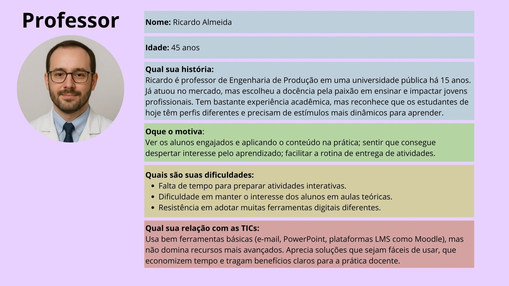
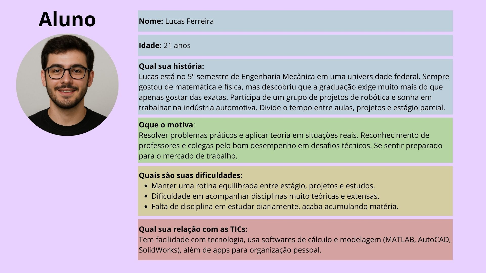

# Projeto Disciplina: Requisitos de Software

Olá! Este repositório faz parte do projeto da disciplina de Requisitos de Software da UTFPR - Campus Cornélio Procópio. 

Link do Padlet: https://padlet.com/rossipoke/kanban-yzskebb8cfh8no7f

## 1. Introdução

***1.1.  Nome do Grupo***

Samuel Ribeiro da Costa - https://github.com/Sam-Ribeiro

Raphael Rossi - https://github.com/rossipoke

***1.2.  Nome do Sistema***

MindSteps

***1.3.  Propósito do Sistema***

Este documento apresenta os requisitos dos usuários a serem desenvolvidos pela **MindSteps Corporation**, fornecendo aos desenvolvedores as informações necessárias para o projeto e implementação, assim como para a realização dos testes e homologação do sistema.

O objetivo do sistema **MindSteps** é oferecer uma plataforma gamificada de apoio ao ensino universitário, permitindo que professores criem desafios de forma prática e que alunos estudem de maneira mais motivadora e recompensadora. A solução busca facilitar o acompanhamento do desempenho, estimular a disciplina nos estudos diários e transformar o aprendizado em uma experiência dinâmica.

***1.2.  Público Alvo***

O público-alvo do aplicativo são professores e estudantes universitários que buscam tornar o processo de ensino mais dinâmico e leve. Professores que precisam de ferramentas práticas para criar e acompanhar atividades, aumentando o engajamento da turma, enquanto alunos desejam métodos de estudo interativos e motivadores que facilitem a organização e a assimilação de conteúdos.

***Personas:***

____

***Análise da situação atual: antes da introdução de sua solução***

*`1. O que as pessoas fazem?`*

Professores preparam listas de exercícios, trabalhos e leituras, geralmente em papel ou PDF.

Alunos recebem as atividades, muitas vezes sem prazos intermediários ou incentivos de engajamento.

O estudo costuma ser individual e pouco interativo, com baixa motivação.

A entrega das atividades ocorre por e-mail ou sistemas acadêmicos engessados.

*`2. Quais os artefatos envolvidos?`*

Apostilas, livros físicos e PDFs.

Plataformas institucionais (como Moodle ou Google Classroom).

E-mail para comunicação.

Papel e caneta para resolução de exercícios.

*`3. O que elas precisam saber?`*

Como acessar as plataformas da universidade.

Datas de provas e entregas de trabalhos.

Conteúdo das disciplinas (geralmente de forma tradicional).

Ferramentas digitais básicas (Word, Excel, PowerPoint).

____

***Análise das tarefas depois: como serão executadas as suas tarefas com sua solução:***

*`1. O que as pessoas fazem?`*

Professores criam desafios diários e atividades gamificadas diretamente no aplicativo.

Alunos acessam os desafios pelo celular ou computador e respondem de forma interativa.

O progresso é acompanhado em tempo real, com pontuações, recompensas e rankings.

Feedback é dado automaticamente ou de forma facilitada pelo professor.

*`2. Quais os artefatos envolvidos?`*

Aplicativo gamificado (plataforma web/mobile).

Sistema de pontuação, recompensas e rankings.

Relatórios automáticos de desempenho.

Conteúdo digital interativo (quizzes, simuladores, vídeos curtos, flashcards).

*`3. O que elas precisam saber?`*

Como usar o aplicativo (interface intuitiva, login, navegação básica).

Regras de pontuação e funcionamento dos desafios.

Conteúdo das disciplinas, mas agora de forma mais aplicada e prática.

Como acompanhar o próprio progresso dentro do sistema.

____

***Cenário: Antes***

Ricardo (professor) envia uma lista de exercícios em PDF por e-mail. Lucas (aluno) baixa o arquivo, resolve no papel e, muitas vezes, esquece de entregar ou deixa para última hora. A motivação é baixa e o estudo é visto apenas como obrigação. Não há acompanhamento em tempo real e o professor demora para corrigir.

***Cenário: Depois***

Ricardo cria desafios diários no aplicativo. Lucas acessa pelo celular no intervalo entre aulas, responde aos exercícios interativos e acumula pontos. Ele acompanha seu progresso no ranking da turma, recebe feedback imediato e se sente motivado a continuar. Ricardo, por sua vez, visualiza relatórios automáticos com os acertos e dificuldades da turma, podendo ajustar o conteúdo das próximas aulas.

## 2. Documentos gerais no repositório

***2.1. Requisitos Funcionais***

| Código  | Nome | Descrição | Prioridade | MoSCoW | Dependencia |
| ------- | ---- | --------- | ---------- | ------ | ----------- |
| RF01 | Busca básica  | O sistema deve permitir buscar por nome de professor, questao especifica, disciplina, ou termo genérico. Resultado com cards resumidos (professor, disciplina, conteudo abordado e previa da questao). | Média | M | RF10 |
| RF02 | Perfil do professor / local | Ao abrir um resultado, exibir: foto/nome, departamento/faculdade, disciplinas que ministra, contato (email/ramal), banco de questoes do professor. | Alta | M | RF10 |
| RF03 | Pontuacao e Score | A depender do tempo de resposta e da resposta escolhida o usuario ganhara pontos para a conta, onde ele pode comparar com os amigos e colegas | Baixa | S | RF10 |
| RF04 | Considerar conflitos | Se uma questao tiver 30 ou mais pedidos de atualização por resposta errada/etc... a questao fica temporariamente desativada da plataforma ate a correção do professor responsavel. | Média | M | RF05 |
| RF05 | Modo professor | Permitir modo de criacao de questoes, avaliacao e edição de questoes criadas pelo proprio professor, referente ao login | Alta | M | N |
| RF06 | Favoritos e histórico | Salvar questoes/professores favoritos e histórico de questões | Média | S | RF10 |
| RF07 | Modos de preferências | O aluno pode escolher por preferencias de conteudos ou disciplinas, podendo se tornar tambem preparatorio para provas ou atividades | Média | S | RF11 |
| RF08 | Autenticação e níveis de acesso | Login via conta institucional (SSO) para acessar funcionalidades restritas (ex.: Perguntas apenas de professores da sua instituição). | Alta | M | RNF11 |
| RF09 | Feedback/Relatar problema | Usuários podem reportar erros nas respostas diretamente ao professor que a fez ou problemas de acessibilidade entre outros para o suporte de desenvolvimento | Média | M | RF10, RF05 |
| RF10 | Banco de dados | Banco relacional (ex.: PostgreSQL) para dados relacionais (professores, disciplinas, conteudos, questoes). | Alta | M | N |
| RF11 | Categorização de perguntas | O sistema deve categorizar perguntas, com os tipos dela (como disciplina, dificuldade, professor criador, assunto...). | Alta | M | RF05 |
| RF12 | Score e competitividade | Os usuarios vao ter uma aba de score e pontuacoes tanto em nivel geral (universidades nacionais) quanto da propria universidade ou amigos | Media | M | RF03 | 
 
***2.2. Requisitos Não Funcionais***

| Código  | Nome | Descrição | Prioridade | MoSCoW | Dependencia |
| ------- | ---- | --------- | ---------- | ------ | ----------- |
| RNF01 | Tempo de resposta | Tempo de resposta para busca simples ≤ 5s | Baixa | M | RF10 |
| RNF02 | Escalabilidade | Suportar crescimento até 3000 usuários ativos simultâneos | Alta | M | N |
| RNF03 | Seguranca de senhas | Senhas não armazenadas localmente. Controle de acesso baseado em papéis; logs de auditoria | Média | S | RFN11 |
| RNF04 | Segurança | Conformidade com LGPD (Brasil) — consentimento para uso de dados pessoais, direito de acesso, exclusão à pedido. Criptografia de senhas. | Média | M | N |
| RNF05 | Usabilidade | UX mobile-first; telas com tempo de aprendizado ≤ 5 min para usuário novo; suporte a acessibilidade WCAG AA (contraste, leitor de tela, navegação por teclado) | Média | M | N |
| RNF06 | Localização/Internacionalização | Texto configurável para PT-BR (padrão); suporte para EN e ES opcional. | Baixa | C | N |
| RNF07 | Autenticação de senhas | Autenticação via SSO; Suporte com login OAuth com o google do e-mail universitário ou credenciais do portal do aluno. | Média | S | RNF11 |
| RNF08 | Atualização de dados em tempo real | Webhooks ou sockets para receber notificações de alteração de questoes do sistema. | Alta | M | N |
| RNF09 | Logs e auditoria | Registrar eventos importantes (login, busca, questoes respondidas, pontos recebidos por questao, alteração de dados) para monitoramento e debugging | Baixa | S | RF10
| RNF10 | Backend e API | REST/GraphQL API para app (endpoints para busca, perfil, favoritos). Autorização baseada em roles. | Alta | M | RF10 |
| RNF11 | Integração com base institucional | API ou ETL para sincronizar dados: cadastro de professores, alunos, turmas, grade horária. | Média | S | N |
| RNF12 | Backup em tempo real | Backup deve ser realizado em tempo real com as informacoes registradas no servidor, onde o mesmo deve gerar uma copia das informacoes atualizadas e enviar o mesmo para o backup | Alta | M | RF10, RNF02 |

***2.3. Perguntas***

Qual disciplina(s) o(a) senhor(a) leciona atualmente e para quais cursos?

Há quanto tempo o(a) senhor(a) atua como docente no ensino superior?

O(a) senhor(a) costuma utilizar recursos digitais ou plataformas on-line em suas aulas? Quais?

Qual sua opinião geral sobre o uso de tecnologias educacionais na universidade?

O(a) senhor(a) já utilizou alguma estratégia de gamificação (como pontuação, ranking, desafios) em suas aulas?

Quais benefícios o(a) senhor(a) acredita que a gamificação pode trazer para o aprendizado dos alunos universitários?

E quais riscos ou limitações o(a) senhor(a) enxerga nesse tipo de abordagem?

Como o(a) senhor(a) imagina que um aplicativo gamificado poderia complementar suas aulas ou avaliações, de forma direta e/ou indireta?

Quais tipos de atividades o(a) senhor(a) acredita que seriam interessantes nesse aplicativo (quiz, desafios semanais, mini provas, etc.)?

Como o(a) senhor(a) gostaria que fosse o sistema de pontuação ou feedback para os alunos?

O(a) senhor(a) acredita que os professores da UTFPR adotariam um aplicativo como esse facilmente?

Quais fatores poderiam incentivar o uso (ex: integração com Moodle, interface simples, reconhecimento institucional)?

Quais fatores poderiam dificultar a adoção (ex: falta de tempo, curva de aprendizado, resistência a novas tecnologias)?

O(a) senhor(a) acredita que os alunos teriam interesse genuíno em competir e colaborar entre si através desse aplicativo?

Que tipo de suporte ou treinamento o(a) senhor(a) acharia importante para usar a plataforma?

O que o(a) senhor(a) mais valorizaria em um aplicativo educacional como esse?

O(a) senhor(a) teria alguma sugestão ou conselho para quem está desenvolvendo esse projeto?

Deseja acrescentar algum comentário ou reflexão sobre o uso de gamificação no ensino superior?

***2.4. Entrevista***

*<Arquivo com as respostas do indivíduo entrevistado e link do drive com upload da gravação.>*

***2.5. Histórias do Usuário***

1) 
Como Aluno, 
eu quero pesquisar professores, atividades, disciplinas ou termo genérico 
de modo que o resultado venha em cards resumidos.

2) 
Como Aluno, 
eu quero acessar o resultado da busca
de modo que tenha acesso ao perfil do professor

3) 
Como Aluno, 
eu quero pontuar ao resposder questões, 
de modo que possa comparar com colegas

4) 
Como Professor, 
eu quero ser notificado quando uma questão minha ficar desativada por erro, 
de modo que possa corrigir e repostar

5) 
Como Professor, 
eu quero poder criar questões e avaliações
de modo que tenha acesso a edição e avaliação dessas questões criadas por mim

6) 
Como Aluno, 
eu quero salvar minhas questões e professores favoritos
de modo que eu possa acessa-los com mais facilidade

7) 
Como Aluno, 
eu quero escolher minhas preferencias de conteudos e disciplinas
de modo que possa me preparar para provas ou atividades

8) 
Como Usuário, 
eu quero acessar o sistema com conta institucional 
de modo que assim tenha acesso a filtros relacionados a minha instituição

9) 
Como Aluno, 
eu quero reportar problemas de acessibilidade e erros nas questões 
de modo que tenha contato direto com o professor ou suporte de desenvolvimento

10) 
Como Usuário, 
eu quero ter minhas ações registradas e bem seguras
de modo que possa acessa-las em outro momento e com privacidade

11) 
Como Professor, 
eu quero categorizar minhas questões
de modo que depois possa filtrar por disciplina, dificuldade, professor, assunto e etc...

12) 
Como Aluno, 
eu quero acessar o rank de pontuações
de modo que possa se comparar tanto em nivel geral de todas universidades, sua universidade ou amigos

----

***2.6. Diagramas de Caso de Uso e Especificações***

*<Imagem, arquivo (PDF), link com Diagrama de Caso de Uso.>*

***2.7. Diagramas de Atividades***

*<Imagem, arquivo (PDF), link com Diagrama de Atividades.>*

***2.8. Protótipos***

*<Imagem, arquivo (PDF), link com Protótipo.>*

## Referências

*<Esta seção é destinada à descrição das referências utilizadas pelo documento, como por exemplo, URLs e livros. Ver exemplo a seguir:>*

[1] “Glossário da _USina_”, <_id_doc glossário_>, Versão <_versão_>. Localização: <_localização_>.
